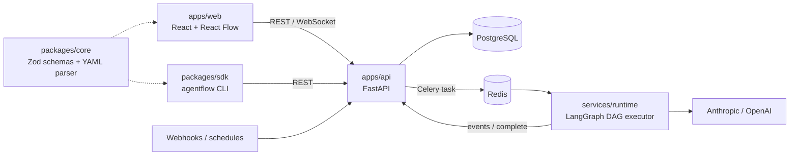

<div align="center">

<!-- TODO: create docs/banner-dark.png and docs/banner-light.png (1280x640) using the noeosorio.com palette (background #18181b, accent #bef264 → #10b981), then uncomment
<picture>
  <source media="(prefers-color-scheme: dark)" srcset="docs/banner-dark.png">
  
</picture>
-->

# ⚡ AgentFlow

**Define multi-agent AI pipelines in one YAML file. AgentFlow compiles, runs, and watches them for you.**


[Architecture](ARCHITECTURE.md) · [Roadmap](docs/ROADMAP.md) · [Report a bug](../../issues)

</div>

Building with AI agents today is chaotic: loose agents nobody monitors, hardcoded prompts, zero cost visibility, and when something breaks nobody knows where or why. AgentFlow turns a declarative YAML spec into a DAG, executes it with LangGraph, and reports status, cost, and output for every node. Think Kubernetes, but for intelligent pipelines.

```yaml
apiVersion: agentflow.ai/v1
kind: Pipeline
metadata:
  name: simple-llm-pipeline
spec:
  nodes:
    - id: start
      type: start
      outputs: [{ key: user_prompt, type: string, required: true }]
    - id: llm_1
      type: llm
      model: { provider: anthropic, model_id: claude-sonnet-4-6 }
      prompt: { user: "{{#start.user_prompt#}}" }
    - id: end
      type: end
      inputs: [{ node_id: llm_1, variable: output }]
  edges:
    - { id: e1, source: start, target: llm_1 }
    - { id: e2, source: llm_1, target: end }
```

More examples in [`packages/core/examples/`](packages/core/examples).

**Contents:** [Features](#-features) · [Quickstart](#-quickstart) · [Configuration](#%EF%B8%8F-configuration) · [Architecture](#%EF%B8%8F-architecture) · [Structure](#-structure) · [Roadmap](#%EF%B8%8F-roadmap) · [Contributing](#-contributing) · [License](#-license)

## ✨ Features

| | |
|---|---|
| **Declarative** | Pipelines, agents, and companies are YAML manifests (`apiVersion` / `kind` / `spec`) validated by Zod schemas in `@agentflow/core`. |
| **Visual canvas** | React Flow editor in `apps/web`. The canvas and the YAML stay in sync; **the YAML is always the source of truth.** |
| **14 node types** | `start`, `end`, `llm`, `agent_pod`, `code`, `http`, `if_else`, `template`, `variable_assigner`, `variable_aggregator`, `iteration`, `human_input`, `knowledge_retrieval`, `sub_workflow`. |
| **DAG runtime** | LangGraph executor with checkpoints, token budgets, dead-letter handling, heartbeats, and event streaming (`services/runtime`). |
| **Observable runs** | Run history, per-node status, pause / resume / stop, human approvals, and live logs over WebSocket (`/api/ws/runs/{run_id}`). |
| **Triggers** | Manual execution, webhooks (`/api/webhooks/{pipeline_id}/{source}`), and schedules. |
| **kubectl-style CLI** | `agentflow apply`, `get`, `delete`, `run`, `logs` from `@agentflow/sdk`. |

## 🖼️ Demo

<!-- TODO: add docs/demo.gif (canvas editing a pipeline + a run streaming logs) -->
Demo coming soon.

## 🚀 Quickstart

### Prerequisites

Node.js ≥ 20, pnpm ≥ 9, Python ≥ 3.12, [uv](https://docs.astral.sh/uv/), Docker.

### Local setup

```bash
git clone https://github.com/NoeOsorio/agentFlow.git
cd agentFlow
pnpm run setup                 # pnpm install + uv sync for apps/api and services/runtime
cp .env.example .env
cp apps/api/.env.example apps/api/.env

# Infrastructure
docker compose up postgres redis -d

# Database migrations (first setup and after every pull)
(cd apps/api && uv run alembic upgrade head)

# Frontend (http://localhost:3000)
pnpm dev

# API (http://localhost:8000, docs at /docs) in a second terminal
(cd apps/api && uv run uvicorn agentflow_api.main:app --reload --port 8000)
```

<details>
<summary>Full stack with Docker</summary>

```bash
docker compose up
# Web  → http://localhost:3000
# API  → http://localhost:8000
# Docs → http://localhost:8000/docs
```

</details>

> [!NOTE]
> `agentflow run` and the **Run** button call `POST /api/pipelines/{name}/execute`, which creates a **pending** run and dispatches a Celery task. The `runtime` container currently starts a health-check stand-in, so runs only progress once a Celery worker consumes the queue (see [`plans/`](plans) and [`services/runtime/`](services/runtime)).

### CLI

The CLI lives in `packages/sdk` and talks to the same HTTP API as the web app. Build it once, then run it from the repo root through the `af` script:

```bash
pnpm --filter @agentflow/sdk build

pnpm run af -- --help
pnpm run af -- config set-context --url http://localhost:8000
pnpm run af -- apply -f packages/core/examples/simple-pipeline.yaml
pnpm run af -- get pipelines
pnpm run af -- run simple-llm-pipeline --input '{"user_prompt":"Hello"}'
```

<details>
<summary>Why <code>pnpm run af --</code> and not <code>pnpm exec agentflow</code>?</summary>

- The `--` separates pnpm arguments from CLI arguments; `packages/sdk/run-cli.cjs` strips the extra `--` pnpm injects so Commander parses flags correctly.
- `pnpm exec agentflow` usually fails with "command not found": pnpm does not expose `@agentflow/sdk`'s `bin` on `PATH` for `exec`, and the root package is also named `agentflow`.
- Alternatives: `pnpm --filter @agentflow/sdk run agentflow -- --help` or `node packages/sdk/dist/cli/index.js --help`.

</details>

### Scripts

| Command | What it does |
|---|---|
| `pnpm run setup` | Install JS deps and sync Python envs (`uv sync --group dev`) |
| `pnpm dev` | Run all dev servers through Turborepo |
| `pnpm build` | Build every package |
| `pnpm test` | Run tests across the monorepo |
| `pnpm lint` | Lint across the monorepo |
| `pnpm run af -- <cmd>` | Run the AgentFlow CLI |

## ⚙️ Configuration

Copy `.env.example` (root) and `apps/api/.env.example` and fill in your own values.

| Variable | Used by | Purpose |
|---|---|---|
| `DATABASE_URL` | API | PostgreSQL connection (`postgresql+asyncpg://…` for the API) |
| `REDIS_URL` | API, runtime | Redis for state and checkpoints |
| `CELERY_BROKER_URL` | API, runtime | Celery broker for pipeline runs |
| `AGENTFLOW_ENV` | API, runtime | `development` / `production` |
| `AGENTFLOW_SECRET_KEY` | API | Signing secret; change it outside local dev |
| `INTERNAL_SECRET` | API | Shared secret for `/api/internal/*` callbacks from the runtime |
| `CORS_ORIGINS` | API | Allowed web origins (JSON list) |
| `ANTHROPIC_API_KEY` / `OPENAI_API_KEY` | runtime | LLM providers per node |
| `KNOWLEDGE_BASE_URL` | API | Optional knowledge base endpoint for `knowledge_retrieval` nodes |
| `GROQ_API_KEY`, `VERCEL_TOKEN`, `VERCEL_TEAM_ID`, `RESEND_API_KEY` | planned | Reserved for upcoming providers and output routers |

> [!WARNING]
> LLM nodes call paid APIs. Set budgets in your manifests and never commit real keys.

## 🏗️ Architecture



Layer diagrams, AgentPod lifecycle, the YAML spec reference, and DAG engine internals live in [ARCHITECTURE.md](ARCHITECTURE.md).

| Layer | Tech |
|---|---|
| Canvas GUI | React 19, React Flow (`@xyflow/react`), Zustand, Tailwind, Vite |
| Schemas | Zod, js-yaml (`@agentflow/core`) |
| API | FastAPI, SQLAlchemy (async), Alembic, PostgreSQL 16 |
| Job queue | Celery + Redis 7 |
| Orchestration | LangGraph, LangChain Anthropic / OpenAI |
| CLI | Commander (`@agentflow/sdk`) |
| Tooling | pnpm workspaces, Turborepo, uv, Docker Compose, Kubernetes manifests |

## 📁 Structure

<details>
<summary>View structure</summary>

```text
apps/
  web/             Vite + React + Tailwind canvas GUI
  api/             FastAPI: companies, pipelines, runs, triggers, agents
  cli-docs/        Astro Starlight site for the CLI docs
services/
  runtime/         LangGraph DAG engine, node implementations, Celery tasks
packages/
  core/            YAML schema, Zod parser, shared TS types, examples
  ui/              Shared React component library
  sdk/             TypeScript SDK + agentflow CLI
infrastructure/
  k8s/             Kubernetes manifests (api, web, worker, postgres, redis)
docs/              Roadmap, architecture, guides, ADRs
plans/             Implementation plans per workstream and PR
```

</details>

## 🗺️ Roadmap

Phases and status are tracked in [docs/ROADMAP.md](docs/ROADMAP.md); per-PR plans live in [`plans/`](plans).

- [x] Monorepo scaffold (Turborepo, core schemas, API, canvas, runtime skeleton)
- [ ] Round-trip YAML ↔ AST ↔ canvas with full validation
- [ ] Production runtime: Celery worker, budgets, retries, dead-letter queue, cost tracking
- [ ] Output routers (deploy, email, social) and first AgentPods

## 🤝 Contributing

AgentFlow is designed to be extended: any agent that implements the `AgentPod` interface plugs into the runtime, and any output that implements `OutputRouter` can receive a pipeline result. Open an [issue](../../issues) to discuss a change before sending a PR. Full interface docs will ship with the first release.

## 📄 License

Distributed under the MIT License. See [`LICENSE`](LICENSE).

---

<div align="center">

Made with ☕ by [Noé Osorio](https://noeosorio.com) and contributors · [business@noeosorio.com](mailto:business@noeosorio.com)

</div>
