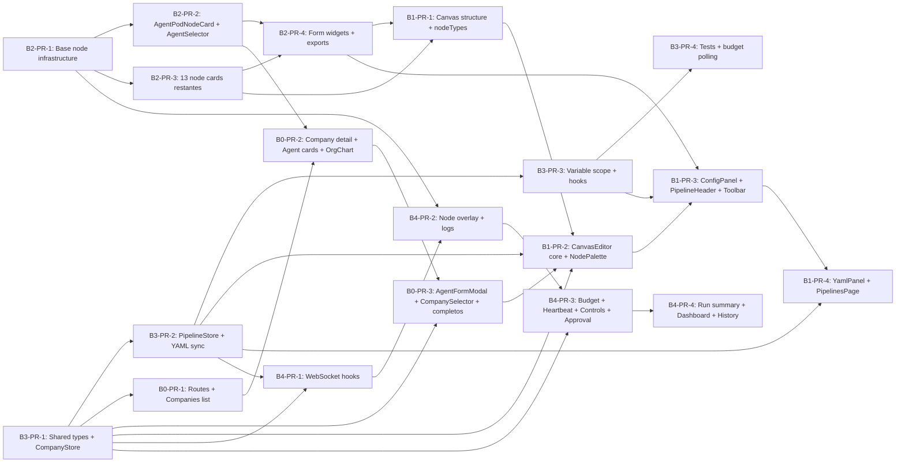

# Merge Order — B0 to B4 Sub-PRs

Complementa el [execution-order.md](execution-order.md) con el desglose granular de sub-PRs dentro de cada plan B.

---

## Diagrama de merge order



**Leyenda:** `A --> B` significa B no puede mergearse hasta que A esté mergeado.
Parallel = los PRs sin flecha entre ellos pueden mergearse independientemente.

---

## Secuencia recomendada de merge

### Fase 1 — Foundations (paralelo máximo)
Estos pueden trabajarse simultáneamente en ramas independientes:

| PR | Rama | Prerequisito externo |
|----|------|----------------------|
| B2-PR-1 | `feat/B2-PR-1-base-node-infrastructure` | A0 + A1 mergeados |
| B3-PR-1 | `feat/B3-PR-1-company-store` | A0 mergeado |

### Fase 2 — Core components (dos chains paralelas)

**Chain B2:**
1. B2-PR-2 (depende de B2-PR-1)
2. B2-PR-3 (depende de B2-PR-1, paralelo con B2-PR-2)
3. B2-PR-4 (depende de B2-PR-2 + B2-PR-3)

**Chain B3:**
1. B3-PR-2 (depende de B3-PR-1 + A1)
2. B3-PR-3 (depende de B3-PR-2)
3. B3-PR-4 (depende de B3-PR-3, leaf)

### Fase 3 — Feature editors (dos chains paralelas)

**Chain B0 (Company Editor):**
1. B0-PR-1 (depende de B3-PR-1)
2. B0-PR-2 (depende de B0-PR-1 + B2-PR-2)
3. B0-PR-3 (depende de B0-PR-2 + B3-PR-1)

**Chain B1 (Canvas Editor) — empieza cuando B2-PR-4 + B3-PR-2 + B0-PR-3 listos:**
1. B1-PR-1 (depende de B2-PR-3 + B2-PR-4)
2. B1-PR-2 (depende de B1-PR-1 + B3-PR-2 + B3-PR-1 + B0-PR-3)
3. B1-PR-3 (depende de B1-PR-2 + B2-PR-4 + B3-PR-3)
4. B1-PR-4 (depende de B1-PR-3 + B3-PR-2, leaf)

### Fase 4 — Execution visualization (Wave 5)

Empieza cuando A3 + B3-PR-2 + B2-PR-1 están mergeados:

1. B4-PR-1 (depende de B3-PR-2 + B3-PR-1 + A3)
2. B4-PR-2 (depende de B4-PR-1 + B2-PR-1)
3. B4-PR-3 (depende de B4-PR-2 + B3-PR-1)
4. B4-PR-4 (depende de B4-PR-3, leaf)

---

## Tabla de commit messages

| PR | Commit |
|----|--------|
| B2-PR-1 | `feat(ui/nodes): BaseNodeCard + NodeHandle + color map [B2-PR-1]` |
| B2-PR-2 | `feat(ui/nodes): AgentPodNodeCard con role badge, budget bar y AgentSelector [B2-PR-2]` |
| B2-PR-3 | `feat(ui/nodes): 13 node cards para control flow, AI, data e integración [B2-PR-3]` |
| B2-PR-4 | `feat(ui/forms): widgets compartidos, config forms y exports del paquete [B2-PR-4]` |
| B3-PR-1 | `feat(web/store): tipos compartidos de store y CompanyStore con YAML sync [B3-PR-1]` |
| B3-PR-2 | `feat(web/store): PipelineStore con YAML sync bidireccional, undo/redo y auto-save [B3-PR-2]` |
| B3-PR-3 | `feat(web/store): variable scope tracker, validation hooks y agent budget hooks [B3-PR-3]` |
| B3-PR-4 | `test(web/store): suite de tests completa y budget polling WebSocket [B3-PR-4]` |
| B0-PR-1 | `feat(web/company): routes, navegación global y Companies list page [B0-PR-1]` |
| B0-PR-2 | `feat(web/company): CompanyPage con AgentGrid y OrgChart interactivo [B0-PR-2]` |
| B0-PR-3 | `feat(web/company): AgentFormModal, YAML panel, BudgetOverview y CompanySelector [B0-PR-3]` |
| B1-PR-1 | `feat(web/canvas): estructura canvas feature, nodeTypes/edgeTypes y CanvasPage [B1-PR-1]` |
| B1-PR-2 | `feat(web/canvas): CanvasEditor con React Flow y NodePalette con company agents [B1-PR-2]` |
| B1-PR-3 | `feat(web/canvas): ConfigPanel, PipelineHeader con CompanySelector, toolbar y shortcuts [B1-PR-3]` |
| B1-PR-4 | `feat(web/canvas): YamlPanel Monaco bidireccional y PipelinesPage [B1-PR-4]` |
| B4-PR-1 | `feat(web/runs): useRunWebSocket y useCompanyAgentWebSocket con agent identity [B4-PR-1]` |
| B4-PR-2 | `feat(web/runs): node overlay con agent identity, RunLogPanel y logsStore [B4-PR-2]` |
| B4-PR-3 | `feat(web/runs): AgentBudgetPanel, HeartbeatSidebar, RunControlsBar y ApprovalModal [B4-PR-3]` |
| B4-PR-4 | `feat(web/runs): RunSummaryCard, CompanyDashboardPage y RunHistorySidebar [B4-PR-4]` |

---

## PRs hoja (sin dependencias downstream dentro de B)

Estos pueden mergearse en cualquier momento una vez que sus prerequisitos estén listos:

- B3-PR-4 — tests y polling (leaf de B3)
- B1-PR-4 — YAML panel y pipelines list (leaf de B1)
- B4-PR-4 — run summary y dashboard (leaf de B4, y de todo el proyecto frontend)

---

## Critical path (frontend B)

```
A0 → B3-PR-1 → B3-PR-2 → B4-PR-1 → B4-PR-2 → B4-PR-3 → B4-PR-4
```

Segunda cadena crítica (canvas completo):
```
A0+A1 → B2-PR-1 → B2-PR-2 → B2-PR-4 → B1-PR-1 → B1-PR-2 → B1-PR-3 → B1-PR-4
```
